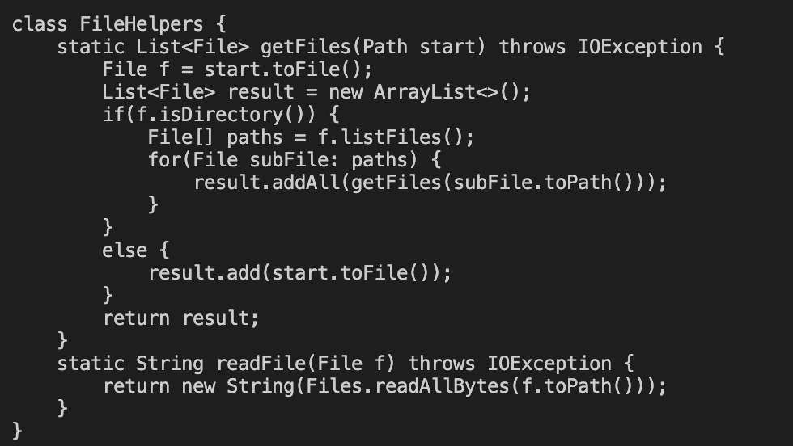
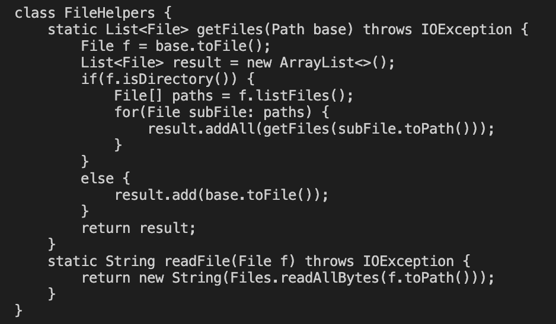

# Lab Report 4
## Part 1
To change the name of the `start` parameter and its uses to `base`, I first opened the file on vim. After opening the file on vim, I pressed `<esc>` to make sure I was in normal mode. I then typed the following command: `:%s/start/base/g`. 
What this command did is that it changed all instances of the paramter `start` to the paramter `base`. The `%` lets vim know the range of the change. The first word between the slashes is the word we are going to find. The second word in the slashes is the replacement word.
The `/g` lets vim know to replace all instances and not just the first. The first two images shows the before and after images. The third image is vim comand.

## Part 2
When doing the experiment it took me 174 seconds to accomplish the first task and it only took me 60 seconds to accompish the second task. Despite being the same task, the only difference is execution, the second way was much more efficient. Despite this, I would prefer vscode because the environment is far more user friendly than vim. For vim, there are all these shortcuts and trying to learn them all would be too much in my opinion. Depending on big the files are, I say for a bigger project vscode would work much better than vim because you can open multiple files at once and compare. Vim only allows you to look at one unless you open multiple termials. 
